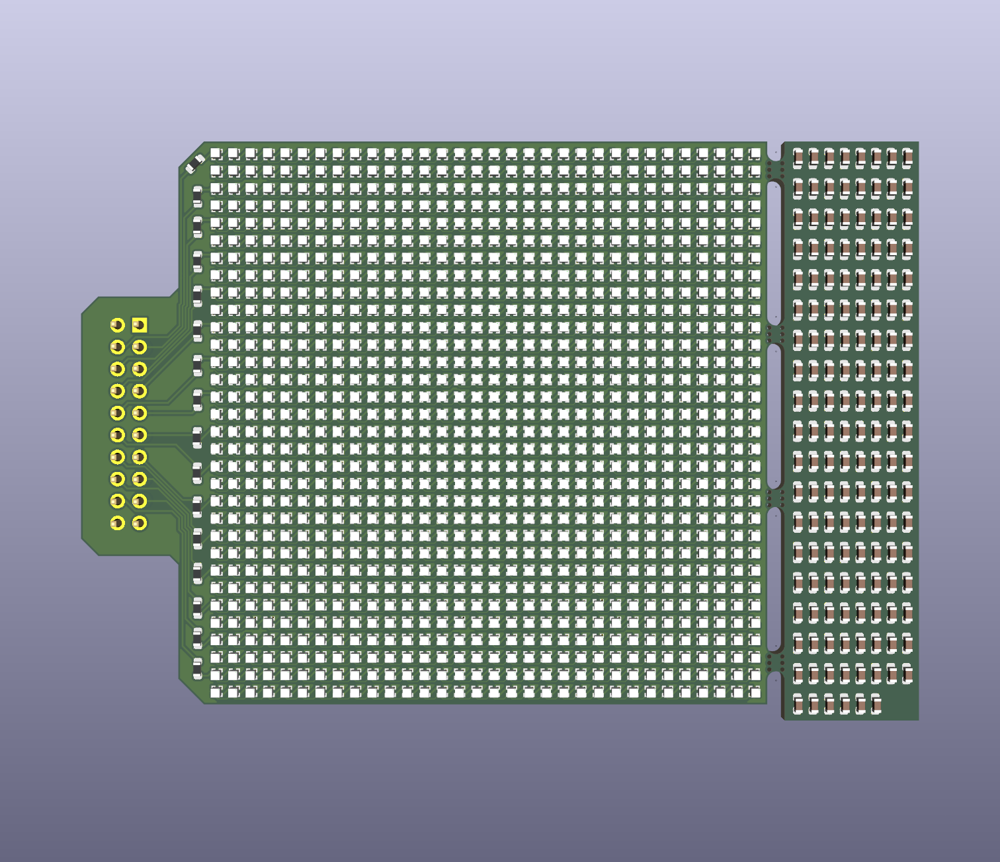

# LED-Display
A 32x32 (64x64mm) RGB LED matrix display

## Features
- Easy to display text and simple graphics
- WS2812B based
- High power (not recommended to run at max power due to thin traces and high heat)
- Theoretical max refresh rate of 500Hz

## Images

